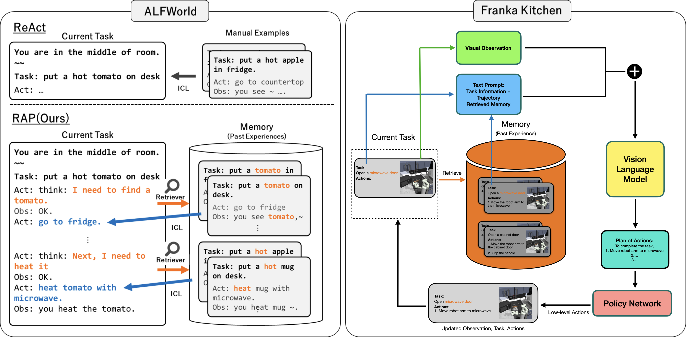

# RAP: Retrieval-Augmented Planning with Contextual Memory for Multimodal LLM Agents
This repository is the implementation of [RAP](https://arxiv.org/abs/2402.03610).



# Get Started
Please refer to the following README's for each benchmark.
* [ALFWorld](./alfworld/README.md)
* WebShop
* Franka Kitchen
* MetaWorld

# Citation
If you find RAP helpful in your research, please consider citing.
```bibtex
@misc{kagaya2024rap,
      title={RAP: Retrieval-Augmented Planning with Contextual Memory for Multimodal LLM Agents}, 
      author={Tomoyuki Kagaya and Thong Jing Yuan and Yuxuan Lou and Jayashree Karlekar and Sugiri Pranata and Akira Kinose and Koki Oguri and Felix Wick and Yang You},
      year={2024},
      eprint={2402.03610},
      archivePrefix={arXiv},
      primaryClass={cs.LG}
}
```

# License
MIT license